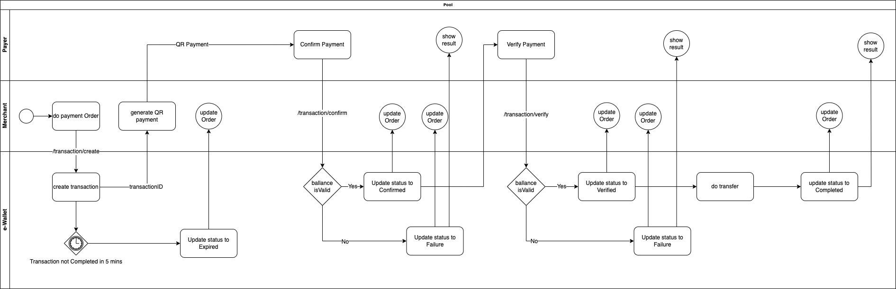

# e-Wallet!

e-Wallet là 1 giải pháp thay thế cho các phương pháp thanh toán truyền thống như tiền mặt hoặc dùng thẻ ngân hàng

#  Một số thuật ngữ sử dụng trong e-Wallet
**Account** : là đối tượng để e-Wallet quản lý tài khoản người dùng. Trong hệ e-Wallet sẽ có 3 loại account chính: 
 - Merchant: là account được tạo ra khi 1 merchant được đăng ký dùng để quản lý doanh thu của 1 cửa hàng
 - Personal: là account của người dùng để thanh toán
 - Issuer: là account được cấp phát cho các ngân hàng, các điểm thu tiền. Đây là loại account có quyền thực hiện gọi lệnh nạp tiền vài tài khoản

**Merchant** : là những cửa hàng online hoặc cửa hàng truyền thống có đăng ký với e-Wallet. Khi đăng ký Merchant e-Wallet sẽ cung cấp 1 account

**Transaction** : dùng để quản lý 1 phiên dao dịch, transaction sẽ có những trạng thái khác nhau
 - Initialized: transaction đã được tạo (đã xác định số tiền và account thụ hưởng)
 - Confirmed: transaction đã được 
 [